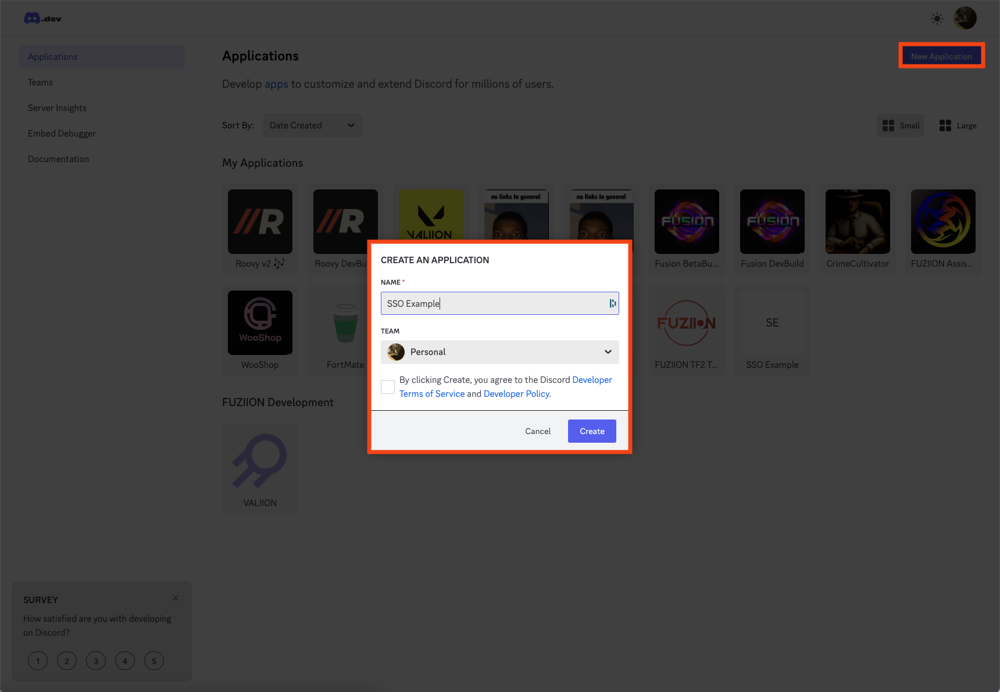
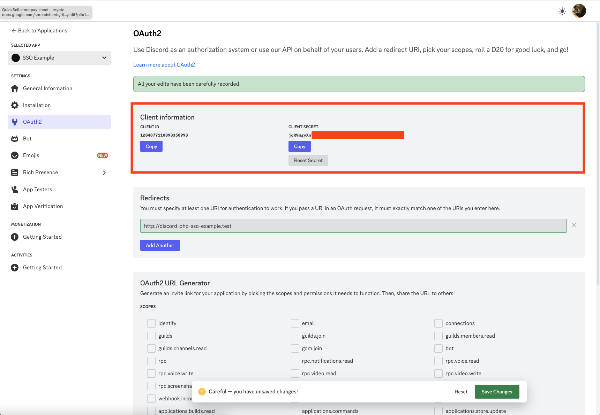
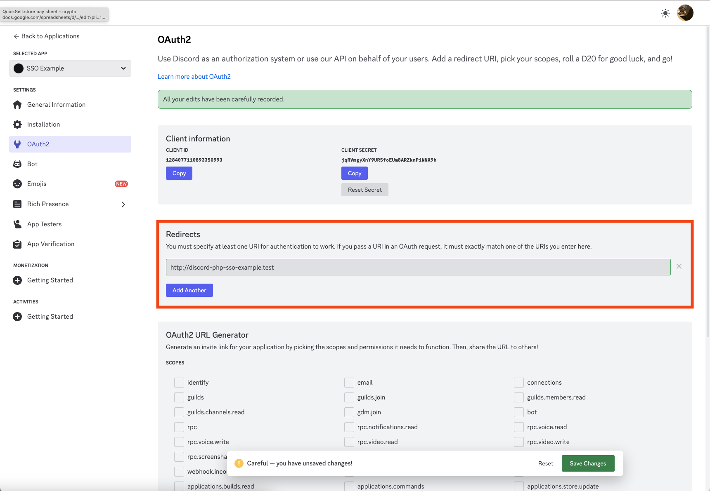
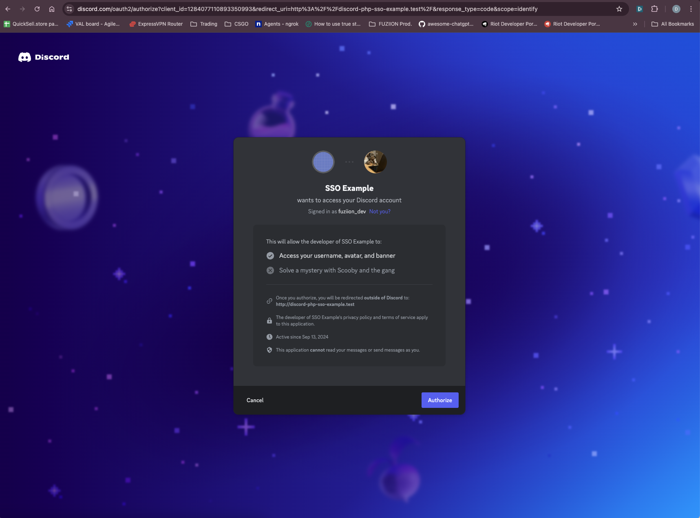

# Discord SSO PHP Example

This project demonstrates how to implement Single Sign-On (SSO) with Discord in PHP. It uses OAuth2 to authenticate
users with their Discord accounts.

## Requirements

- PHP 7.4 or higher
- A Discord application (create one in the [Discord Developer Portal]())

## Installation

1. Clone the repository or download the project files.

   ```bash
   git clone https://github.com/yourusername/discord-sso-php-example.git
   cd discord-sso-php-example
   ```

2. Install dependencies (if any). You can use Composer if additional libraries are needed.

   ```bash
   composer install
   ```

3. Create a `.env` file or directly configure your Discord application credentials in the `index.php` file.

## Setting Up a Discord OAuth2 Client for SSO

Follow these steps to configure your Discord application for Single Sign-On (SSO) using OAuth2.

### Step 1: Create a New Application

1. Go to the [Discord Developer Portal](https://discord.com/developers/applications).
2. Click on the **New Application** button in the top right corner.
3. Name your application (e.g., "SSO Example") and select your team if applicable.
4. Check the box agreeing to the Discord Developer Terms of Service and Developer Policy.
5. Click **Create**.

   

### Step 2: Configure OAuth2 Settings

1. After creating the application, navigate to the **OAuth2** section on the left sidebar.
2. Copy your **Client ID** and **Client Secret** as you'll need these for your application.

   

3. Scroll down to the **Redirects** section and add your application's redirect URL. This URL should match the one used
   in your code (e.g., `http://your-domain.com/callback`).

   

### Step 3: Authorize Your Application

1. Generate an OAuth2 authorization URL using the **OAuth2 URL Generator** at the bottom of the OAuth2 settings page.
2. Select the necessary scopes for your application (e.g., `identify` to access the user's username, avatar, and
   banner).
3. Copy the generated URL and navigate to it in your browser.
4. You will be prompted to authorize your application to access your Discord account.

   

By following these steps, your Discord OAuth2 client will be correctly set up and ready to be integrated with your
application.

## Configuration

1. Open `index.php` and replace the following placeholders with your actual Discord application credentials:

   ```php
   $clientId = 'YOUR_CLIENT_ID';         // Replace with your Client ID
   $clientSecret = 'YOUR_CLIENT_SECRET'; // Replace with your Client Secret
   $redirectUri = 'YOUR_REDIRECT_URI';   // Replace with your Redirect URI
   ```

2. Ensure your redirect URI is correctly configured in the Discord Developer Portal under your application's OAuth2
   settings.

## Example Usage

In the [index.php](index.php) file there is an example of how to use the Discord SSO class in your project.

## How It Works

1. **Initialization**: The `DiscordSSO` class is instantiated with your Discord application credentials.
2. **Login**: The user clicks the "Log in with Discord" button, which redirects them to Discord for authentication.
3. **Authorization**: After authorizing the application, the user is redirected back to the specified redirect URI with
   a `code`.
4. **Access Token**: The code is exchanged for an access token, which is then used to fetch the user's Discord
   information.

## License

This project is licensed under the MIT License. See the [LICENSE](LICENSE) file for details.
